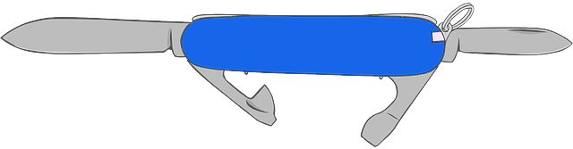

# Knife

A collection of useful micro-modules for Lua.

 * [knife.base](readme/base.md) - A base class for class-based OOP.
 * [knife.behavior](readme/behavior.md) - A state machine manager.
 * [knife.bind](readme/bind.md) - Bind arguments to functions.
 * [knife.chain](readme/chain.md) - Flatten async code with chained functions.
 * [knife.convoke](readme/convoke.md) - Flatten async code with coroutines.
 * [knife.event](readme/event.md) - Dispatch and handle events.
 * [knife.memoize](readme/memoize.md) - A memoization function.
 * [knife.serialize](readme/serialize.md) - Store data structures as strings.
 * [knife.system](readme/system.md) - An entity component system.
 * [knife.test](readme/test.md) - A fixture-free test framework.
 * [knife.timer](readme/timer.md) - Create timers and tweens.

Each module is self-contained, with no dependencies.

 

